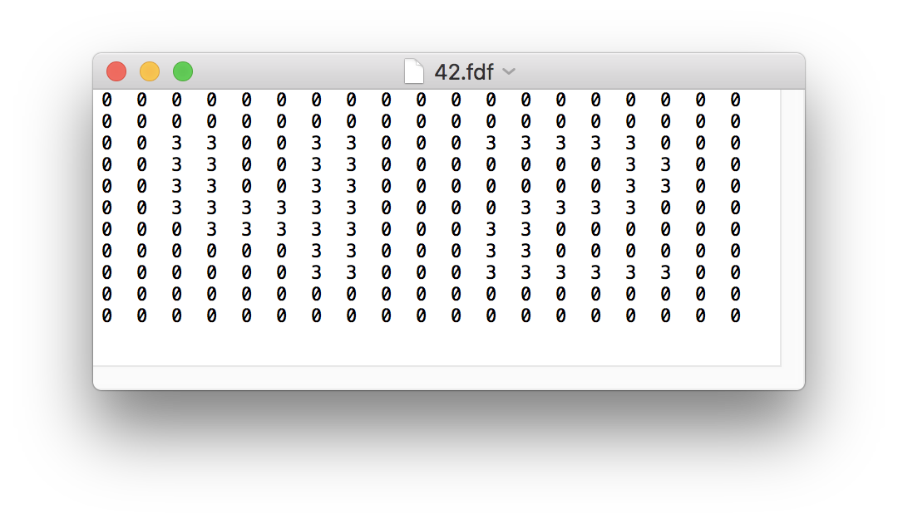
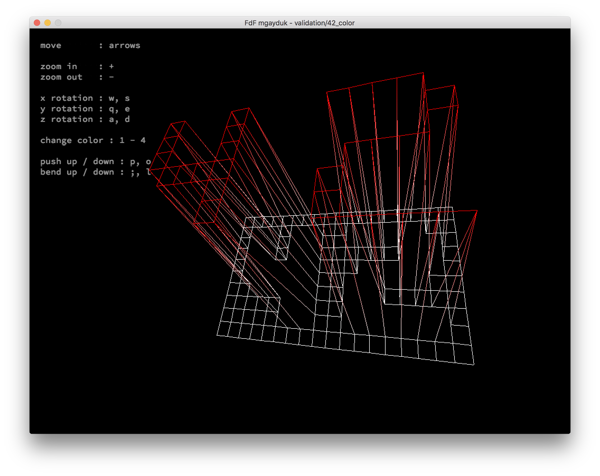
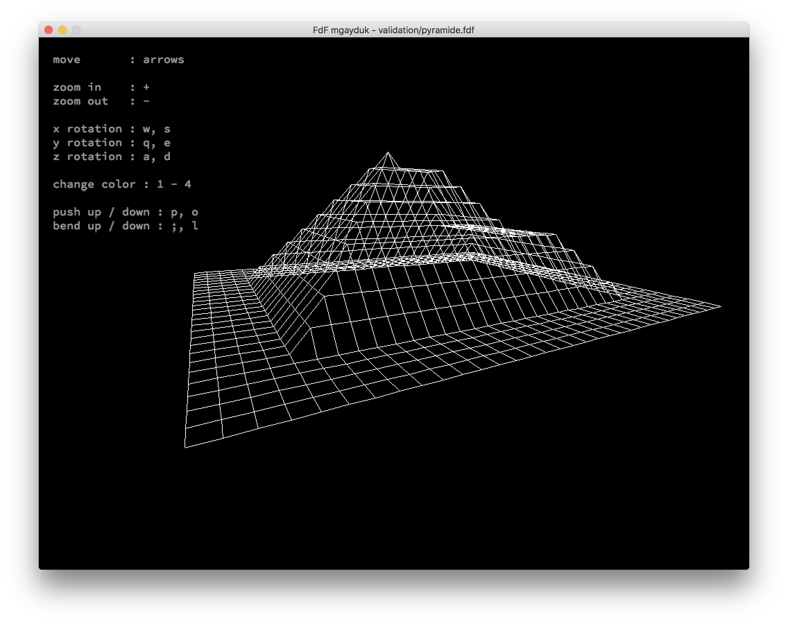
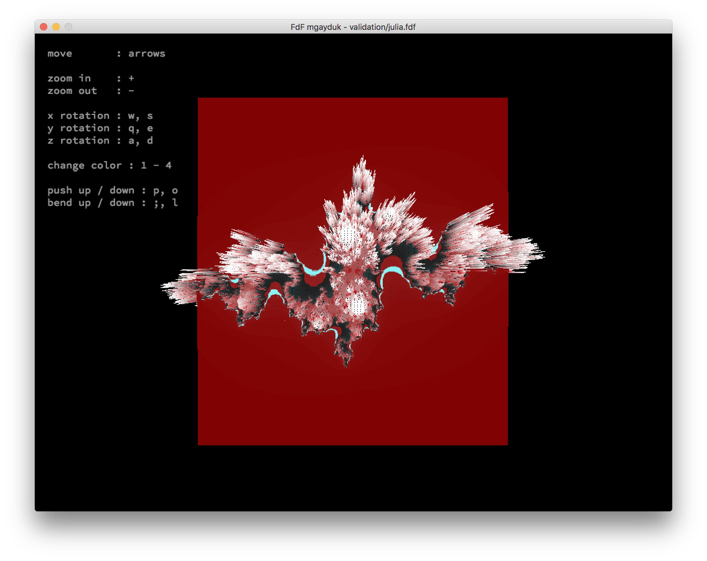

# 42_fdf

First computer graphic project of 42school.

The goal of the project is to draw wireframe model that specified in input file.
The model can be moved, rotated, scaled and deformed in runtime. 

Usage ./fdf [map-file]

map-files can be found in validation folder

Example of map-file:

Result:

More exaples:

